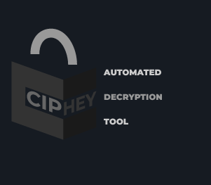

<p align="center">

 
<p align="center">➡️ <a href="http://discord.skerritt.blog">Discord</a> ⬅️</p>
<p align="center">  </p>

<p align="center">The Fastest Hash Cracking System<br>
<code>pip3 install search-that-hash && sth</code>
</p>

# 🤔 Overview


Tired of going to every website to crack your hash? Search-That-Hash automates this process in less than 2 seconds.
Search-That-Hash searches the most popular hash cracking sites and automatically inputs your hash(s) for cracking

# 🔍 Features

* **⌨️ Auto-Type Identification** - No need to know the hash type, Search-That-Hash uses [Name-That-Hash](https://github.com/HashPals/Name-That-Hash) to get accurate results on the type of the hash.
* **📵 Offline Mode** - Not connected to the internet? No worries, Search-That-Hash will automatically run Hashcat for you.
* **💨 Fast** - We're all busy people and that's why we've dedicated time to make Search-That-Hash as fast as possible.
* **🦾 JSON API** - As well as JSON output for CLI we also offer an API.
* **♿ Accessible** - We are 100% [ Accessible](https://skerritt.blog/a11y/).
* **🎫 Extensible** - Adding sites to Search-That-Hash is as easy as printing "hello world" !
* **🌈 Beautiful** - The colours were hand-selected to be as gnarly and accessible as possible .
* **☮️ Ethical** - We search hashes ethically and legally.

# 📴 Offline Mode


Couldn't find it in any API? 😢 STH automatically pipes your input into Hashcat 🥳

Make sure to specify a wordlist if you want STH to use HashCat with `-w /path/to/wordlist`. If you are on Windows you must specify the path to your HashCat binary and folder in config.json 🙂
# 🔨 Installation

Install Search-That-Hash as fast as you can read this README. No, seriously -- it's that easy  😎

```pip3 install search-that-hash```

or:

```pip install search-that-hash```

then:

``sth``

To run.

**Note**: We can't guarantee all of the APIs provide perfect privacy due to being closed source. If you need to crack sensitive, personal information please use the offline mode or Hashcat directly.

# 👪 Project Family

Like Search-That-Hash? We have 2 other projects you'll **love**!

<table>
    <thead>
        <tr>
            <th colspan="2">Project Family</th>
        </tr>
    </thead>
    <tbody>
        <tr>
          <td align="center"><b><a href="https://github.com/HashPals/Name-That-Hash">Name-That-Hash</a></b></td>
          <td align="center"><b><a href="https://github.com/ciphey/ciphey">Ciphey</a></b></td>
        </tr>
      <tr>
        <td></img></td>
          <td>
            <p align="center">
              </img>
            </p>
          </td>
      </tr>
      <tr>
        <td>Instantly identify what type of hash it is. With support for over 300 hashes, descriptions and popularity ratings!</td>
        <td>
          Automatically decrypt ciphers, decode encodings, crack hashes, and more. Not sure what the text is? Use this!
      </td>
    </tbody>
    </thead>
</table>

# 🎥 Demos


<p align="center">Greppable mode</p>

# ✨ Google Colab

We now have support for running STH on google colab for faster hashcat cracking, no need to worry about running hashcat on your machine anymore! Many thanks to [Drago](https://twitter.com/vaishnavpardhi) for making this :-)

https://github.com/vaishnavpardhi/colabsth/

# 📖 Documentation

Want to know how everything works? 

Or maybe want to use the API!

Thats why we have documentation!

| 📚 **Documentation** | 🐦 **My Twitter (@ me for questions)** | 🎳 **Discord** 
| --------------- | ----------------------------------- | ---------------- | 
| [Wiki](https://github.com/HashPals/Search-That-Hash/wiki) | [JaySec](https://twitter.com/Jayy_2004) | [Discord](http://discord.com/invite/zYTM3rZM4T) | 

# ✍️ Contributing

We would love any contributions to search-that-hash, thats why we've made it as simple and as easy as we can to contribute! Simply follow the docs on "Contributing" 😇

# ❤️ Final thanks

Thank you so much to  [Bee](https://twitter.com/bee_sec_san) who pretty much mentored me the whole way through this process and never failed to provide help and great [resources ](https://skerritt.blog/)for me to learn, carry on the great work! :)

Thank you also to [Fawaz](https://twitter.com/q8fawazo) for the amazing website!  🚧

......And to [Jabba](https://github.com/JabbaTheBunny) & [Skeletal](https://github.com/SkeletalDemise) for helping out with some of the code 💻

Thank you to the TryHackMe community, they taught me so much in infosec and its a pleasure being part of it!

Lastly, this project was inspired by [Hashbuster](https://github.com/s0md3v/Hash-Buster) so thank you for the work!

